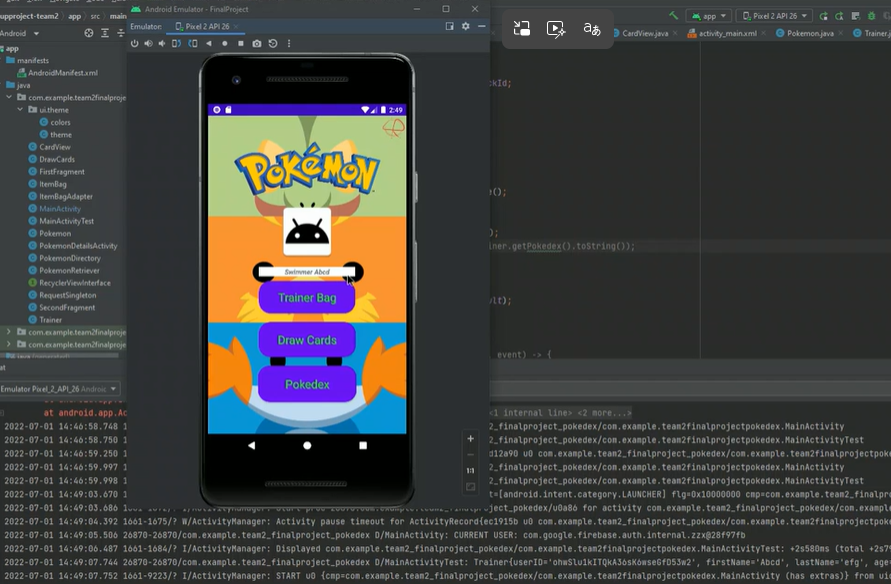
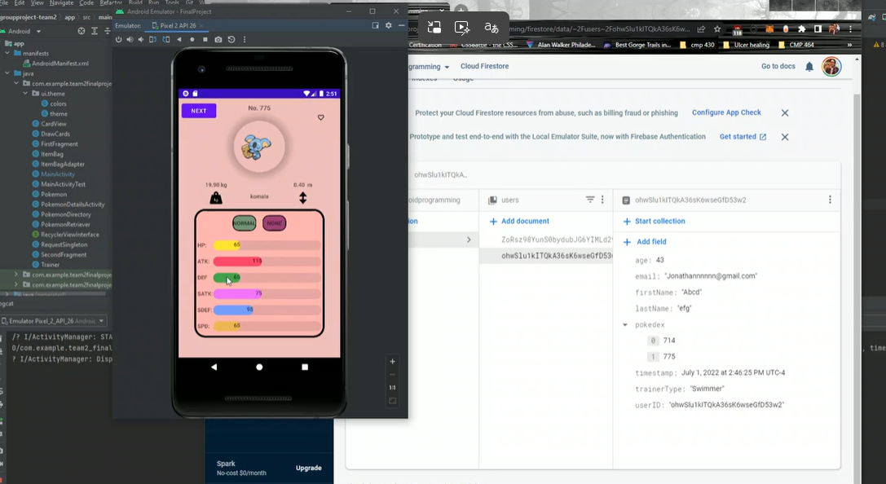
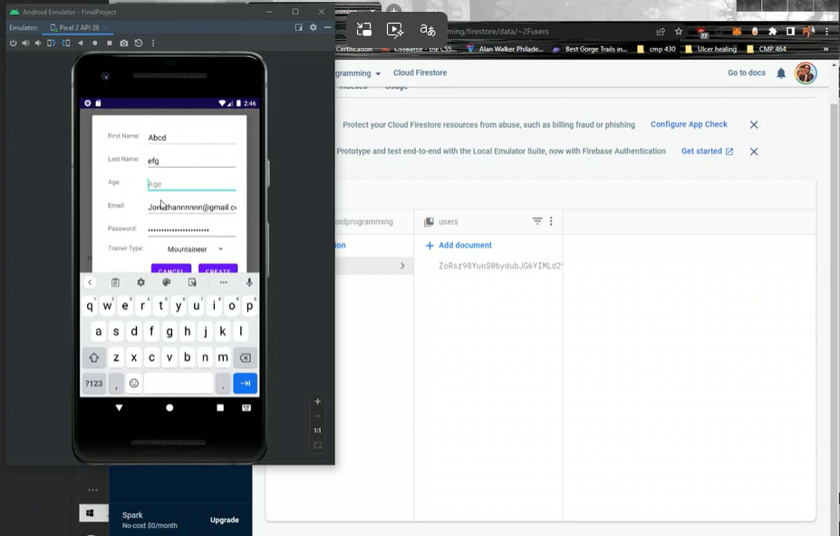

# Pokédex — Android App

A native Android Pokédex written in **Java**. Browses Pokémon from a REST API, loads sprite artwork, and displays each Pokémon's stats in a detail view.

  
  
  

<!-- Run in Android Studio's emulator, screenshot the list and a detail screen,
     save as docs/screenshot-list.png and docs/screenshot-detail.png -->

## Features

- Fetches live Pokémon data from a REST API over HTTP
- Detail screen with per-Pokémon stat visualization
- Image loading and caching for sprite artwork
- Fragment-based navigation between list and detail views
- Firestore database for authentication and account information

## Tech stack

| Concern | Choice |
|---|---|
| Language | Java |
| Networking | Volley, with a shared `RequestSingleton` request queue |
| Images | Glide |
| Navigation | AndroidX Navigation (fragments + nav graph) |
| UI | Material Components, ConstraintLayout |
| Testing | JUnit, Espresso scaffolding |

## Key classes

- `PokemonRetriever` — API calls and response parsing
- `RequestSingleton` — single shared Volley request queue (standard Android networking pattern)
- `Pokemon` — data model
- `PokemonDetailsActivity`, `FirstFragment`, `SecondFragment` — UI flow

## Run it

Open in Android Studio, let Gradle sync, and run on an emulator or device (minSdk per `app/build.gradle`).

## Why this project

Built to practice real Android fundamentals: consuming a REST API, request-queue and image-caching patterns, and multi-screen navigation — the same concerns behind any production data-driven mobile app.

---
**Jonathan Rosario** · [Portfolio](https://github.com/Zypherous) · [LinkedIn](https://www.linkedin.com/in/jonathan-r-tech-professional/)
